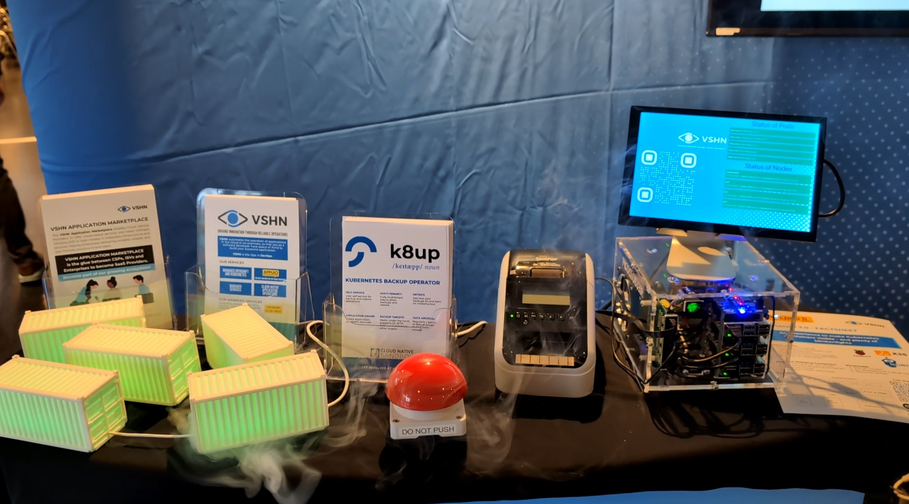

# VSHN Conferenceli

When attending conferences or Meetups, we bring some fancy hardware to attract people to our booth:

* Big red chaos-button which randomly deletes Pods on a Kubernetes instance
* 3D printed shipping containers with LEDs which represent the state of the running Pods
* A Raspberry Pi which runs everything locally with [K3s](https://k3s.io/)
* A label printer which prints a booth raffle ticket



## Hardware Setup

```
                                      Shipping Containers                      
                                                                               
                 USB  ┌───────┐  ┌───────┐  ┌───────┐  ┌───────┐  ┌───────┐    
               ┌──────┤ LEDs  ├──┤ LEDs  ├──┤ LEDs  ├──┤ LEDs  ├──┤ LEDs  │    
               │      └───────┘  └───────┘  └───────┘  └───────┘  └───────┘    
               │                                                               
               │                                                               
               │                                                               
               │                                                               
               │                                                               
               │   ┌──────────────────┐                 ┌─────────────────────┐
               │   │                  │     Ethernet    │                     │
               └───┤ Raspberry Pi 5   ├─────────────────┤ Brother QL-820NWBc  │
                   │                  │                 │                     │
               **  └────────┬─────────┘                 └─────────────────────┘
           *****            │                                                  
Bluetooth  *                │ HDMI                                             
           *                │                                                  
  ┌─────────┐         ┌─────┴──────┐                                           
  │         │         │            │                                           
  │ Red     │         │  HDMI      │                                           
  │ Button  │         │  Display   │                                           
  │         │         │            │                                           
  └─────────┘         └────────────┘                                           
  ```

**Hardware list**:

* [Raspberry Pi 5 Model B 8GB](https://www.pi-shop.ch/raspberry-pi-5-8-gb)
* [Argon NEO 5 M.2 NVME Case for Raspberry Pi 5](https://www.pi-shop.ch/argon-neo-5-m-2-nvme-case-for-raspberry-pi-5)
* [128 GB NVMe M.2 PCle Gen3x4 2280 Internal SSD](https://www.pi-shop.ch/128-gb-nvme-m-2-pcle-gen3x4-2280-internal-ssd)
* [27W USB-C PD Power Supply EU Plug White](https://www.pi-shop.ch/27w-usb-c-pd-power-supply-eu-plug-white)
* [Elecrow 10.1 inch Display IPS 1280x800](https://www.elecrow.com/elecrow-10-1-inch-display-ips-1280x800-acrylic-case-touch-screen-compatible.html)
* [Brother QL-820NWBc](https://www.brother.ch/de-ch/etiketten-und-belegdrucker/ql-820nwbc)
* [BlinkStick Flex](https://www.blinkstick.com/products/blinkstick-flex)
* [Buzzer Taster Rot](https://www.bastelgarage.ch/buzzer-taster-rot)
* [Puck.js](https://www.puck-js.com/)
* 3D-printed shipping container:
  * [Shipping Container](https://www.thingiverse.com/thing:4809607)
  * [3D Druck Service](https://3d-druck-service.ch/)

## Raspberry Pi setup

The Raspberry Pi runs standard latest Raspberry Pi OS and [boots directly from the NVME SSD](https://learn.pimoroni.com/article/getting-started-with-nvme-base), no SD card is inserted.

### K3s installation and bootstrapping

It is installed using the upstream installer:

```
curl -sfL https://get.k3s.io | sh -s - \
  --tls-san '192.168.173.10' \
  --tls-san 'conferenceli' \
  --embedded-registry \
  --disable-cloud-controller
```

All deployments are done via Argo CD from the `deployment/` folder:

```
kubectl create ns argocd
kubectl -n argocd apply -f deployment/apps/argocd/install.yaml
kubectl -n argocd apply -f deployment/argoapps
```

Some apps need secrets, they aren't managed by GitOps, but are manually applied:

```
kubectl -n $app apply -f deployment/apps/$myapp/secret.yaml
```

### Networking

The Raspberry Pi needs to be connected to a wireless network with Internet connectivity.
This is needed to expose the applications on it to the Internet and to pull container images running on the K3s instance.

Furthermore, it runs a Dnsmasq DHCP server to assign a static IP to the label printer, which is directly connected to the Raspberry Pi.

Configuration of `/etc/dnsmasq.d/landhcp`:

```
interface=eth0
port=0
bind-dynamic
domain-needed
bogus-priv
dhcp-range=192.168.173.100,192.168.173.200,255.255.255.0,12h
dhcp-host=94:dd:f8:a4:a5:53,label-printer,192.168.173.100,infinite
```

### Desktop configuration

The latest Raspberry Pi OS runs with Wayland with [Wayfire](https://github.com/WayfireWM/wayfire), its configuration is at `.config/wayfire.ini`.

The most important parts of the Wayfire configuration:

```
[autostart]
podstatus = bash -c "until curl --output /dev/null --silent --head --fail http://localhost:32231; do printf '.'; sleep 5; done; chromium-browser "http://localhost:32231" --kiosk --noerrdialogs --disable-infobars --no-first-run --ozone-platform=wayland --enable-features=OverlayScrollbar --start-maximized"

[core]
plugins=alpha animate autostart autostart-static command cube pixdecor expo fast-switcher fisheye grid idle invert move oswitch place resize switcher vswitch window-rules wm-actions wrot zoom winshadows hide-cursor
```

To hide the mouse cursor, a plugin is used.
See [this StackExchange](https://raspberrypi.stackexchange.com/questions/145382/remove-hide-mouse-cursor-when-idle-on-rasbperry-pi-os-bookworm) article for more information.

## Apps

### Podstatus with LEDs

The Podstatus app lives in the `podstatus/` folder.
It serves two main purposes:

* A simple web application which displays the live status of the Pods and does the actual chaos Pod deletion
* A controller which manages the BlinkStick LEDs in the shipping containers

Both apps are connecting to the Kubernetes API and are watching the Pod status.

The web application is a Flask application and uses [htmx](https://htmx.org/) with [Server Sent Events](https://htmx.org/docs/#sse) to dynamically update the Pod status.
By issuing an authenticated `GET` request to the `/chaos` endpoint, a random Pod in the configured namespace gets deleted.

On startup, an autostart command in the Wayfire configuration tries to connect to the Podstatus web application.
Once this is successfull, a full-screen Chromium kiosk session is started, displaying the Podstatus web application.

#### The Red Button

The red buzzer button contains a [Puck.js](https://www.puck-js.com/) button, wired to the red button itself.
It connects via Bluetooth to the Raspberry Pi and emulates a HID device, a keyboard.
The file `puckjs-redbutton.js` contains the code running on the Puck.js.

A configuration in Wayfire calls `curl` on a button press:

```
[command]
binding_chaos=<ctrl> <alt> KEY_G
command_chaos=sh -c "notify-send -t 2000 $(curl -s -u username:password http://localhost:32231/chaos | jq .message)"
```

### Contactform with Printer

The Contactform app lives in the `contactform/` folder.
It serves two main purposes:

* Collecting leads at the conference booth and store them in Odoo as CRM lead
* Printing of labels for all kind of fun, for example for the booth raffle

The application connects to the Odoo API to store the collected leads, and it connects to the label printer over the network to print labels.
A simple configuration is available at the authenticated `config/` endpoint.
It allows configuration of the Odoo campaign name, the label header and can optionally enable or disable label printing and lead creation.

As the application runs directly on the Raspberry Pi, it needs to be available on the Internet, so that a booth visitor can directly access it.
This is made possible with FRP, see next section.

The label printing was made possible thanks to the fantastic [brother_ql_web](https://github.com/FriedrichFroebel/brother_ql_web/) Python module.

### Connectivity from the Internet

To allow connections from the Internet to the Raspberry Pi, the Raspberry Pi needs to be connected to a WLAN with Internet connectivity.
It then uses [frp - fast reverse proxy](https://github.com/fatedier/frp) to tunnel connections.
